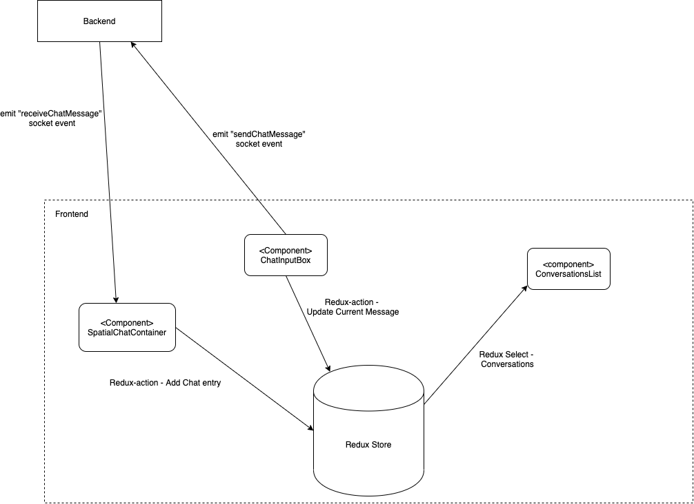
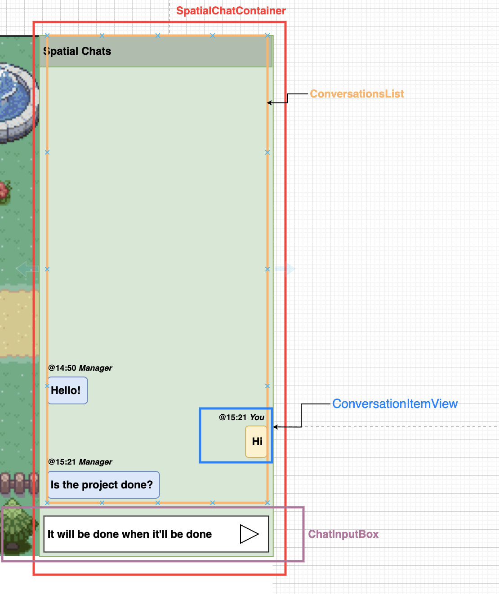
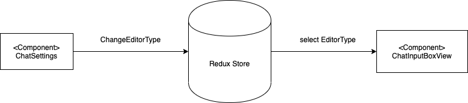

# Spatial Chat Design

This document describes the design decisions that were made for individual user-stories.


## Chatting with another user

### Backend
- There are no public listeners. There is no specific methods to add-listeners any more. The listeners are registered automically when a user connects and listens to updates.

TODO: Add something here


### Frontend

The following diagram represents how the spatial-chat feature interacts with the backend.

<kbd>
	
</kbd>

Spatial Chat stores all of the data in a Redux store. We used redux primarily due to the fact that there are multiple components that might need to interact with data. Having a centralized store, makes it easier for different components to fetch them and not depend on their ancestor-components passing them through component-props.

As shown in the above diagram, whenever the frontend receives a `receiveChatMessage` event, it is added to the store. The ConversationsList component listens to changes to the store and automatically renders the new data whenever the store is updated.

When a user types in a message and sends it, the frontend emits a "sendChatMessage" event to the backend.

Before we began coding up the frontend, this was the mock-up we based it off of. The labels indicate the names of the components. 

<kbd>
	
</kbd>


## Blocking another user

### Backend

TODO: Add something here

### Frontend

TODO: Add something here


## Rich text editor

This was a frontend-only feature. The redux store contains a property called     `settingChatEditorType` which holds the current editor type. Whenever the user changes the setting, this value will change, as indicated in the below diagram. 

<kbd>

</kbd>

The final redux store properties that we used for all the features looks like this - 

```js
ChatReducerState = {
    chats: [],
    settingChatEditorType: ChatEditorType.DEFAULT_EDITOR,
    settingChatBroadcastRadius: constants.DEFAULT_BROADCAST_RADIUS,
    blockedPlayerIds: [],
};
```