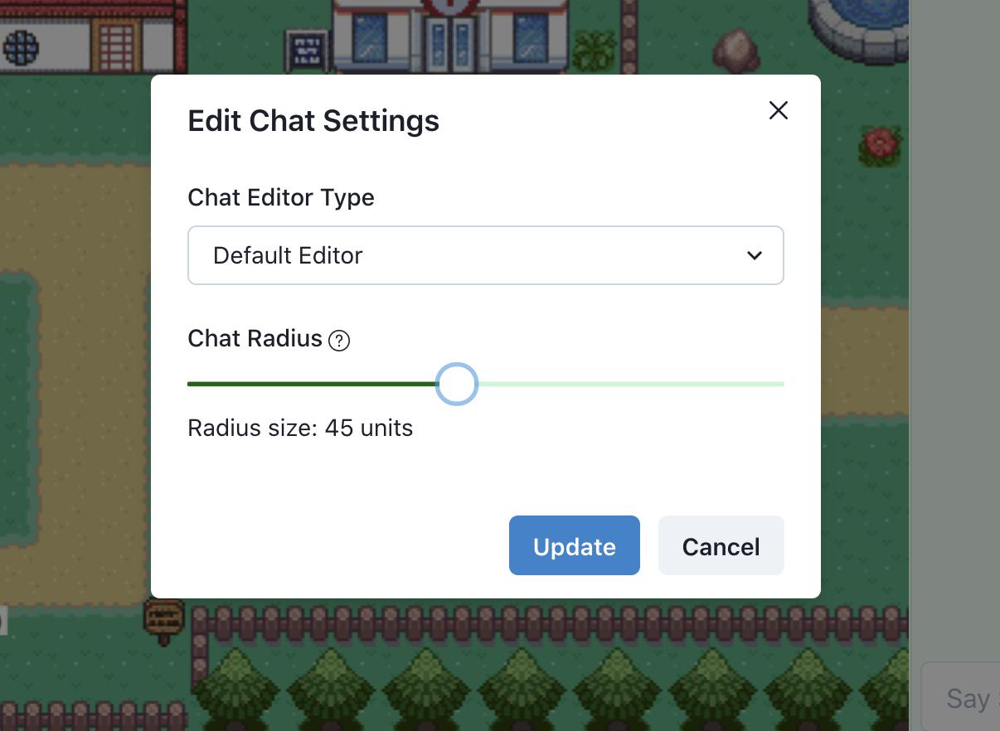

## Spatial Chat

Spatial chat is a feature where a user can send a text-message to another user near them, in the same town.

### Chatting with another user
- Join a room
- On the right of the page (next to the map), there is a chat-box. You can use this to chat with people near you!
- Select the chat box which says "Say Something..." and type away. 
- You can send a chat by pressing <kbd>Enter</kbd> key or clicking on chat icon right next to the chat-box.
- The application will automatically figure out people who are near you and send your message to them. These are the same users you can video chat with too.
- The sent message will appear in your chat-box, along with message details
- The sender can see the recipients by hovering over a particular message and clicking on the arrow icon. A dropdown will appear, with a list of recipients, under the "Sent To" section.
- As a recipient of a message, you can see the messages sent from other users near you, and when it was sent.

<kbd>
	
</kbd>

### Blocking another user
You can prevent another user from sending any chat messages to you, by blocking them. Note that, if a user has blocked someone, they can no longer send them any messages as well.

In order to block a user, follow these steps - 
- In the chat-box, hover over the message of the user that you want to block. 
- Click on the arrow icon, to reveal the dropdown.
- Toggle the "Block User" option to block or unblock a user.

Note that, when you block a user, you are blocking them interacting with you, only by chat. The setting just affects the spatial-chat and not the spatial-video feature.

<kbd>
	
</kbd>

### Rich text editor
Covey.Town provides an option to use a "Rich Text Editor" to send messages with, apart from the default editor. 

To enable the rich text editor - 
- Scroll to the bottom of the screen, and click on the "Chat Settings" link
- This will open up a dialog box, in which you'll have a dropdown with the label - "Chat Editor Type".
- Choose "Rich Text Editor" from the dropdown 
- Click on the "Update" button to switch to "Rich Text Editor" on the chat-box!

### Rich Text Editor Features
- Bold 
- Italics
- Underline
- Strikethrough
- Font color
- Text Highlight
- Font Type
- Clear Formatting

<kbd>
	
</kbd>

### Chat Radius

The "nearness" of the users around you is defined by this setting. This ranges from 80 to 1000. The smaller the number, smaller your chat boundary is. the means your messages will be sent to only those people, who are within that boundary. Note that, The "Chat Radius" setting just affects the spatial-chat and not the spatial-video feature.

<kbd>
	
</kbd>

